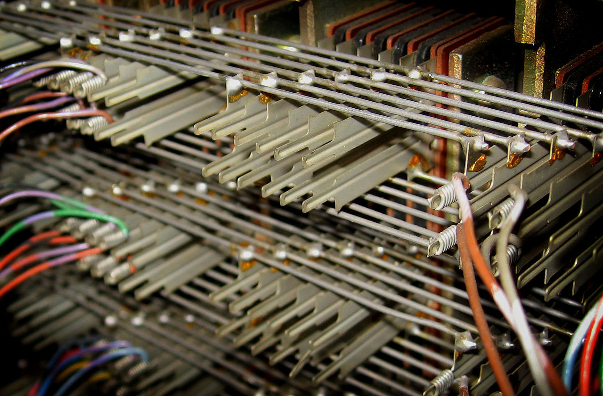
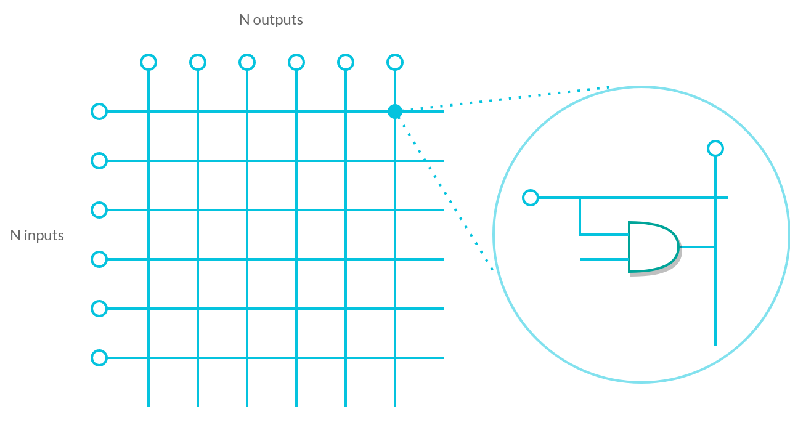
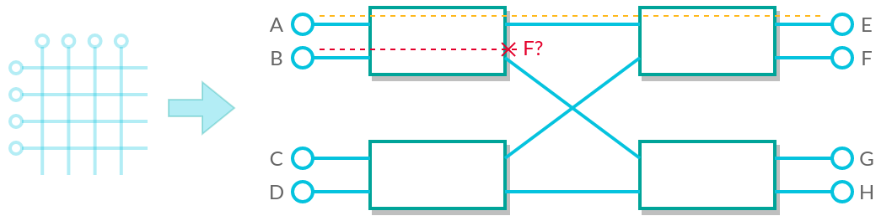
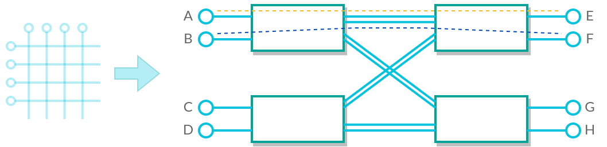
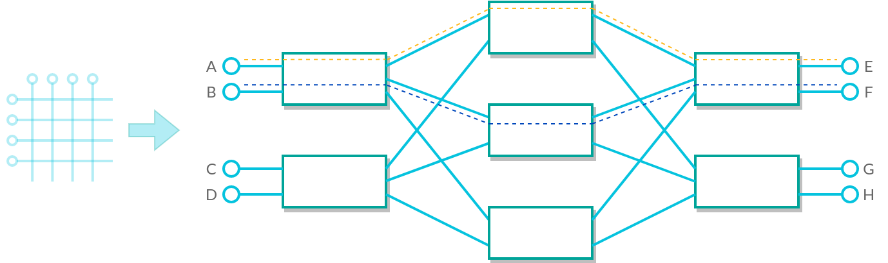
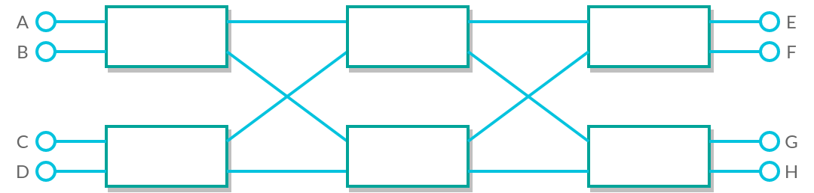
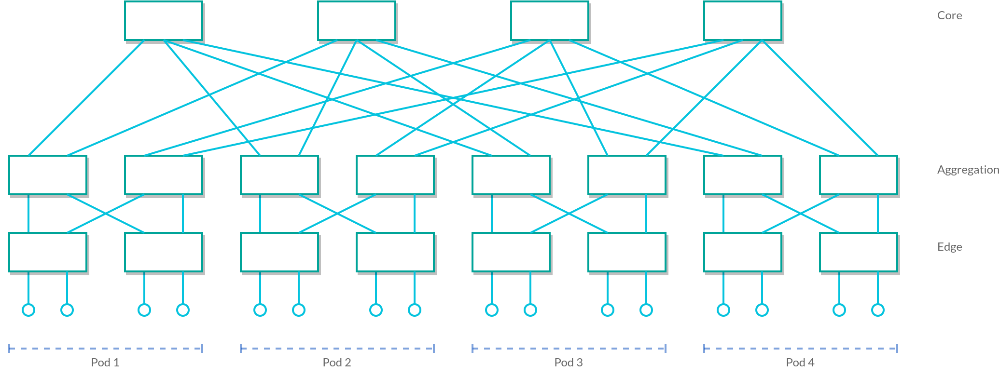
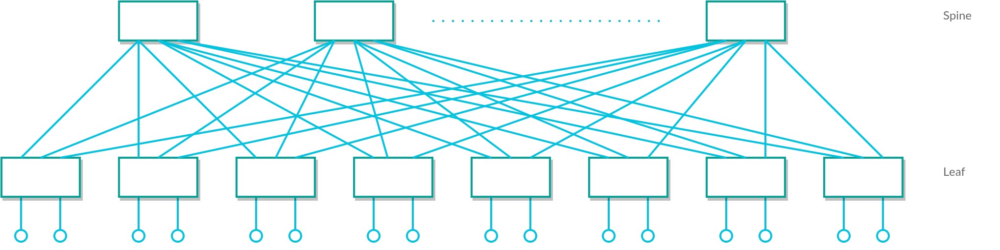

<!-- 
_class: lead
_header: ""
_footer: ""
_paginate: false
-->

### www.vsb.cz

---

[comment]: # (######################################################################################)
<!-- 
_class: lead 
_paginate: false
_footer: ""
-->

### Modeling and Dimensioning of Networks

# Network Topologies in Data Center Networks

Ing. Jan Rozhon, Ph.D.

---

[comment]: # (########################################################################)

# Key Concepts to know

- switching:
    - circuit vs packet
    - space vs time
- evolution of switching systems
    - telephony networks (generations 0 -> 5)
    - computer networks (DARPA, ethernet, TCP/IP stack)

<!-- 
- Students should be able to describe the features of various switching types
- discuss the evolution of telephony networks
    - manual switching
    - strowger swich
    - !!! crossbar switch
    - Stored Program Control - decentralized microprocessors
    - digital exchanges - centralized, fully digital, ISDN
    - voip - softswitches
- features of packet switching, why it was a preferred
-->

---

[comment]: # (########################################################################)

# Key Concepts to know

- basic network topologies:
    - point-to-point
    - bus
    - star
    - mesh
    - ring
    - tree

<!-- 
- pros and cons of these topologies, possibly the technologies that use them
-->

---

[comment]: # (########################################################################)

# Historical Context

- space switching in 2nd gen. = **crossbar** switch ([image source](https://en.wikipedia.org/wiki/File:Crossbar-banjo2-hy.jpg))

---

[comment]: # (########################################################################)

[comment]: # (Move bg image down so it does not interfere with heading)

# Crossbar switch

<!-- 
- describe crossbar switch
- mention controller that is connected to the other input of the AND gate
- possibly mention ferreed
-->

---

[comment]: # (########################################################################)

# Crossbar switch

- number of inputs/outputs does not have to be the same
- number of crosspoints defines the complexity of the switch

$$
C(N) = N^2 \ \ \ \ [-]
$$

- PRO: non-blocking architecture
- CON: very difficult to scale (until high density microcontrollers/processors)

<!--
- space requirements given primarily by the crosspoint implementation
- however, inputs are also a limit! Example: pins on microprocessor
- mention manufacturing costs
- discuss blocking vs nonblocking and relate to circuit switch/space switching
-->

---

[comment]: # (########################################################################)

# Improving scaling capabilities

- splitting monolithic switch into a network of simpler switches
- 2-stage?

<!-- 
- simple 2x2 network does not work as non-blocking
-->

---

[comment]: # (########################################################################)

# Improving scaling capabilities

- Adding multiple connections?

<!-- 
- adding connections work, but how about complexity?
-->

---

[comment]: # (########################################################################)

# Improving scaling capabilities

- Complexity now:

$$ C(n) = 2 \cdot mn^2 $$
$$ m= n^2 $$
$$ C(N) = 2N^2 \ \ \ \ [-] $$

- n - inputs/input switches
- m - outputs
<!-- 
- Considering only square rule - there is n input switches, each with n inputs
- complexity grows twice as quickly as for crossbar
-->

---

[comment]: # (########################################################################)

# Clos Networks

- a network with 3 stages (or odd number of stages)
- exactly one link between switches in neighboring stages

<!-- 
- mention possible asymmetry of inputs/output on individual switches
- example is non-blocking
-->

---

[comment]: # (########################################################################)

[comment]: # (make 2 columns)

# Clos Networks

## Strictly non-blocking
$$ C(n) = 3 \cdot mn^2 $$
$$ m \ge 2n - 1 $$
$$ C(n) = 3 \cdot (2n-1)n^2 $$
$$ C(N) = 6N^{\frac{3}{2}}-3N \approx 6N^{\frac{3}{2}} \ [-] $$
## Rearrangably non-blocking
$$ C(n) = 3 \cdot mn^2 $$
$$ m \ge n $$
$$ C(n) = 3 \cdot n^3 $$
$$ C(N) = 3N^{\frac{3}{2}} \ \ [-] $$

<!-- 
- calculate the number of crosspoints for small and big numbers
-->

---

[comment]: # (########################################################################)
# Benes Networks

- special case of rearrangably non-blocking Clos network
- m=n=2

<!--
- 2 log2N − 1 stages
-->
---

[comment]: # (########################################################################)

<!--
_class: lead
-->
# Q: How do we construct networks with more inputs?

---

[comment]: # (########################################################################)

# Transition to modern topologies

- extreme increase of elements in datacenter netwoks
- need for failover routes
- cabling complexity grows
- required scaling as the needs grow
- required low latency connections
- emergence of cloud computing and big data

---

[comment]: # (########################################################################)

# Fat Tree Topology

- a special case of the Clos/Benes network
- efficient and fault-tolerant connectivity
- hierarchical design with multiple paths between nodes
- key features:
    - uniform bandwidth
    - redundancy
    - load balancing

---

[comment]: # (########################################################################)

# Fat Tree Topology

---

[comment]: # (########################################################################)

# Spine-Leaf Topology

- a two-tier architecture:
    - spine = backbone switches
    - leafs = access switches
- every leaf switch is connected to every spine switch
- key features:
    - scalability - a bit easier than for fat tree
    - reduced latency
    - fault tolerance

---

[comment]: # (########################################################################)

# Spine-Leaf Topology

<!--
- focus on east-west traffic
- internet connection is on one of leaves
- microservices architecture
- CON: cabling
-->

---

[comment]: # (########################################################################)

# And many more

- butterfly networks
- omega networks
- hypercube
- torus
- etc.

---

[comment]: # (########################################################################)

# In the Lab

- modeling of simple network elements using ns-3
- topological aspects of the simulation
    - standard topologies
    - clos network/spine-leaf network
- protocol stack
- application layer simulation

---

[comment]: # (########################################################################)
<!-- 
_class: lead
_header: ""
_footer: ""
_paginate: false
-->

### www.vsb.cz
Ing. Jan Rozhon, Ph.D.
:telephone_receiver: 596 995 900
:email: jan.rozhon@vsb.cz
