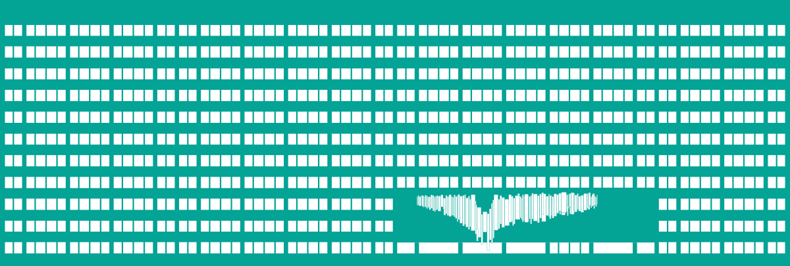
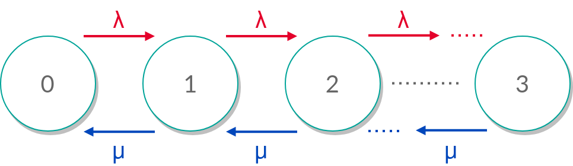

<!--
_class: lead
_header: ""
_footer: ""
_paginate: false
-->

### www.vsb.cz

---

[comment]: # "######################################################################################"

<!--
_class: lead
_paginate: false
_footer: ""
-->

### Modeling and Dimensioning of Networks

# Queuing Theory in the Field of Computer Networks

Ing. Jan Rozhon, Ph.D.

---

[comment]: # "########################################################################"

# Introduction to Queuing Theory

- mathematical study of waiting lines (queues)
- queues are present everywhere
  - computer networks
  - hardware elements
  - service lines
  - ...

<!--
- General presence of queues in everyday life
-->

---

[comment]: # "########################################################################"

# Field importance

- network modeling
  - design
  - performance evaluation and estimation
  - cost reduction
  - waiting time elimination
  - predictive analysis
- network dimensioning

<!--
- 
-->

---

[comment]: # "########################################################################"

# Key concepts

- servers - physical servers, routers, cashiers,...
- customers/requests
- arrival rates - λ
- service rates - μ
- Poisson process
  - completely independent events (no memory)
  - average rate

---

[comment]: # "########################################################################"

# Queue types

- FIFO
- LIFO
- Priority Queues
- SIRO
- ...

---

[comment]: # "########################################################################"

# Little's law

- Little’s Law is a fundamental formula in queuing theory.
- It relates the number of customers in a system (L), the arrival rate (λ), and the average time a customer spends in the system (W).
- Formula: L=λW

---

[comment]: # "########################################################################"

# Little's law - assumptions, usage

- assumptions
  - the system is stable and in a steady state
  - arrival rate and service rate are consistent

- usage
  - network performance analysis (i.e. packets in the system)
  - resource allocation and capacity planning
  - traffic management

---

[comment]: # "########################################################################"

# Little's law - scenario

- web server receives an average of 100 requests per minute (λ)
- on average, each request spends 2 seconds in the system (W)

$$
\begin{aligned}
L &=λW \\
L &=100\cdot\frac{1}{30} \\
L &≈3.33
\end{aligned}
$$

---

[comment]: # "########################################################################"

# Markov chains

---

[comment]: # "########################################################################"

# Queue models

- remember Kendall's notation?
- M/M/1 system,
- M/M/c system,
- other?

<!--
A/S/c/K/N/D where K is the capacity of the queue, N is the size of the population of jobs to be served, and D is the queueing discipline.
-->

---

[comment]: # "########################################################################"

# Key metrics

- utilization $\rho = \frac{\lambda}{\mu}$
- throughput,
- waiting time,
- queue length

---

[comment]: # "########################################################################"

# What is modeled?

- TCP vs UDP
- server-client vs p2p
- symmetric vs asymmetric traffic
- short-lived vs long connections
- packet sizes

<!--
students give examples

• around 50% of packets are as large as possible:
– these are TCP data packets;
– recall, it is determined by MTU of Ethernet: 1500 bytes;
– around 50% of packets are 1500 bytes in length.
• around 40% of packets are as small as possible:
– these are TCP ACKs;
– recall, it is determined by headers of TCP (20 bytes), IP (20 bytes): 40 bytes;
– around 40% of packets are 40 bytes in length.
• around 10% of packet lengths are uniformly distributed between 40 and 1500;
• additional peaks: fragmentation of IP packets.
-->

---

[comment]: # "########################################################################"

# Points of interest

- location in network
  - customer side
  - network side (and where in the network - access, aggregation, backbone)
- used application
  - voice/video
  - data

---

[comment]: # "########################################################################"

<!--
_class: lead
_header: ""
_footer: ""
_paginate: false
-->

### www.vsb.cz

Ing. Jan Rozhon, Ph.D.
:telephone_receiver: 596 995 900
:email: jan.rozhon@vsb.cz
